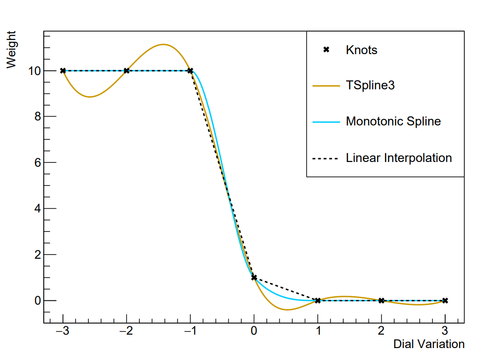

Splines
=======

This module provides the utility for dealing with spline parameters. For some background reading se the `Splines wiki page <https://github.com/mach3-software/MaCh3/wiki/05.-Splines>`_.

The main class which represents individual spline functions is :py:class:`pyMaCh3.splines.ResponseFunction`. 
This is an abstract representation which covers multiple different types of interpolation, where the type of interpolation is specified at the time of construction.
The available interpolation types are defined by :py:class:`pyMaCh3.splines.InterpolationType`. Here are some examples

To construct a ResponseFunction you must specify the x and y positions of the knots, and the interpolation type like in the following example::

    from pyMaCh3 import splines

    TSpline3_response_1 = splines.ResponseFunction([0.0, 1.0, 2.0], [1.0, 0.5, 2.0], splines.InterpolationType.Cubic_TSpline3)
    linear_response_1 = splines.ResponseFunction([10.0, 11.0, 12.0], [6.0, 0.0, 0.5], splines.InterpolationType.Linear)

    TSpline3_response_2 = splines.ResponseFunction([0.0, 1.0, 2.0], [2.0, 3.0, 0.0], splines.InterpolationType.Cubic_TSpline3)
    linear_response_2 = splines.ResponseFunction([10.0, 11.0, 12.0], [3.0, 0.0, 4.5], splines.InterpolationType.Linear)

Another important part of this module is the :py:class:`pyMaCh3.splines.EventSplineMonolith` class which allows you to easily and speedily deal with event-by-event splines in your analysis.
To build this you first need to construct a response function for each event-by-event spline parameter for each of your events as in the example above.

Let's take those example responses and build a simple EventSplineMonolith::
    
    monolith = splines.EventSplineMonolith([[TSpline3_response_1, linear_response_1], [TSpline3_response_2, linear_response_2]])

This will create an EventSplineMonolith which can deal with the reweighting of two events with two spline parameters.
We now need to be able to set the values of the parameters so that we can calculate event weights. 
This is done using the :py:func:`pyMaCh3.splines.EventSplineMonolith.set_param_value_array` function. 
This allows us to bind a numpy array to our EventSplineMonolith, whose values we can change, and this will set the values of the parameters inside of the monolith.
This works as follows::

    # we need to keep track of how many parameters we have
    # in our case this is two
    n_parameters = 2

    # we initialise the array, the initial values don't matter too much so we'll make them zero
    param_array = np.zeros((n_parameters,))

    # now we bind this array to the monolith we made above
    monolith.set_param_value_array(param_array)

    # now changes made in the param_array will be propagated to the monolith
    param_array[0] = 0.5
    param_array[1] = 11.042

.. warning::
    Once your array has been bound to your spline monolith that you keep it safe and don't overwrite it by doing something like::
        
        param_array = np.array([0.5, 11.0])

    as this will mean the original array (the one that is bound to your monolith will be lost forever and you will no longer be able to set parameter values!).
    You need to set the values using indexes as above, or if you want to set them all at once you use slicing like::

        param_array[...] = [0.5, 11.0]

    This may seem a bit faffy but it is intended to avoid unneccessary copying from python to c++ so we can keep things nice and speedy.

Happy splining!

.. automodapi:: pyMaCh3.splines
   :members:
   :undoc-members:
   :show-inheritance: