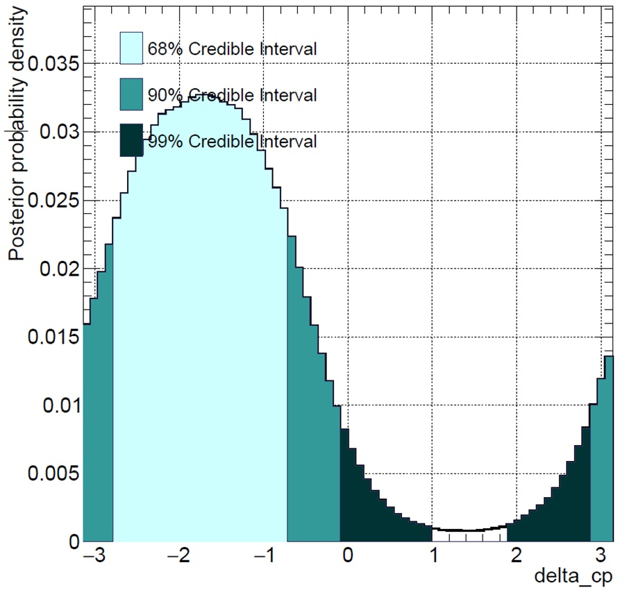
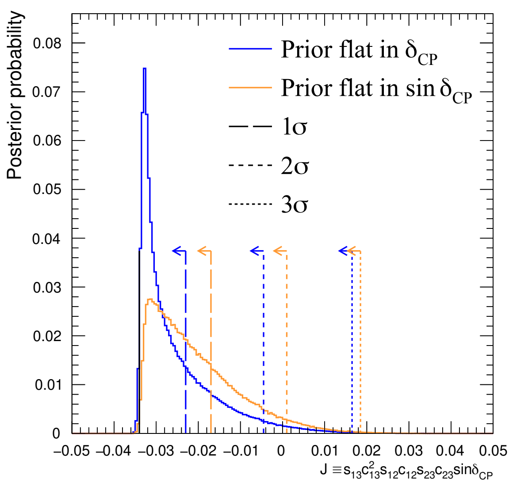

# MaCh3 
The Markov Chain 3 flavour is a framework born in 2013 as a Bayesian MCMC fitter for [T2K](https://t2k-experiment.org/pl/) oscillation analysis. It has now been used for multiple T2K Oscillation analyses both at the Near and Far detectors throughout the years and is also used by the DUNE and HK oscillation analysis groups as well as for joint fits between T2K and NOvA and T2K and SK's atmospheric data.

The framework has also evolved to allow non MCMC modules to interrogate the likelihoods implemented.


[](https://github.com/mach3-software/MaCh3/blob/develop/LICENSE.txt)
[](https://github.com/mach3-software/MaCh3/releases)
[](https://github.com/mach3-software/MaCh3/wiki)
## Famous Plots
TODO this should be expanded




## Cite
When citing MaCh3, please use [on Zenodo](https://zenodo.org/records/10949376) [](https://doi.org/10.5281/zenodo.10949376).

# How to Compile
MaCh3 follows standard cmake pattern. By default you should get most optimal build setting although below we list many configurable options:
```
mkdir build;
cd build;
cmake ../
make -jN [set number of threads]
make install
```

Don't forget to:
```
source bin/setup.MaCh3.sh
```
## Building against MaCh3
If you compiled MaCh3 and sourced it you can simply call
```
find_package(MaCh3)
```
and cmake will find it. Alternatively, you can use CPM, for example:
```
CPMFindPackage(
  NAME MaCh3
  GIT_TAG "blarb"
  GITHUB_REPOSITORY mach3-software/MaCh3
)
```
Once you found MaCh3 you might want to link your library against MaCh3. You can do this as follows:
```
target_link_libraries(blarb MaCh3::All)
```

Some functionalities rely on setting `Env{MACH3}` which should point to path experiment specific MaCh3. This way MaCh3 can easily find `Env{MACH3}/inputs/SomeInput.root` for example.

## Multithreading
MaCh3 quite heavily relies on Multithreading, it is turned on by default. If for debugging purposes you would like to turn it off please use

```
cmake ../ [-DMaCh3_MULTITHREAD_ENABLED=<OFF>]
```

## CUDA
If the system has access to GPU, MaCh3 will enable GPU functionality automatically. If you would like to CPU only despite having access to CUDA
```
mkdir build; cd build;
cmake ../ [-USE_CPU=ON]
```
MaCh3 supports quite a high range of CUDA architectures if something doesn't work on your GPU let us know. MaCh3 supports only NVIDIA GPUs.


## Oscillator
MaCh3 uses several neutrino oscillation calculators. By default, CUDAProb3 is used. If you would like to use Prob3++

```
cmake ../ [-DUSE_PROB3=<ON,OFF>]
```
Following neutrino oscillation calculators are available:

|Oscillator  | Hardware   | Source     |
|------------|------------|------------|
| CUDAProb3  | CPU/GPU    | Beam/Atm   |
| Prob3++    | CPU        | Beam       |
| probGPU    | GPU        | Beam       |

## Fitting algorithms
The following fitting algorithms are available:

| Algorithm  | Need Ext Library |
|------------|------------------|
| MR2T2      | No               |
| MINUIT2    | Yes              |
| PSO        | No               |


## Debug
Several debugging options are available which are heavy for RAM and performance and, therefore not used by default. To enable it:
```
cmake ../ [-DMaCh3_DEBUG_ENABLED=<ON,OFF>]
```
There are several debug modes, to enable more detailed but very heavy specific debug levels. Level 1 is the default debug activated by the above.

```
cmake ../ [-DMaCh3_DEBUG_ENABLED=<ON,OFF>] [-DDEBUG_LEVEL=<1,2,3>]
```
## System Requirements
Most of external libraries are being handled through CPM. The only external library that is not being handled through CPM and is required is [ROOT](https://root.cern/). Currently used external dependencies include:

1. [yaml-cpp](https://github.com/jbeder/yaml-cpp)
2. [spdlog](https://github.com/gabime/spdlog)

Based on several test here are recommended version:
```
  GCC: ...
  CMake: >= 3.14
  ROOT: >= 6.18
```

# How To Use
This is an example how your executable can look like using MaCh3:
```
  manager *fitMan = nullptr; //Manager is responsible for reading from config

  std::vector<samplePDFBase*> sample; //vector storing information about sample for different detector
  std::vector<covarianceBase*> Cov; // vector with systematic implementation
  mcmc *markovChain = nullptr; // MCMC class, can be replaced with other fitting method
  MakeMaCh3Instance(fitMan, sample, Cov, markovChain); //Factory like function which initialises everything

  //Adding samples and covariances to the Fitter class could be in the factory
  for(unsigned int i = 0; sample.size(); i++)
    markovChain->addSamplePDF(sample[i]);
  for(unsigned int i = 0; Cov.size(); i++)
    markovChain->addSystObj(Cov[i]);

  markovChain->RunLLHScan(); // can run LLH scan
  markovChain->runMCMC(); //or run actual fit
```

## Help and Guidelines
- [How to contribute](https://github.com/mach3-software/MaCh3/blob/develop/CONTRIBUTING.md)
- [Wiki](https://github.com/mach3-software/MaCh3/wiki)
- [Mailing lists](https://www.jiscmail.ac.uk/cgi-bin/webadmin?A0=MACH3)
- [Slack](https://t2k-experiment.slack.com/archives/C06EM0C6D7W/p1705599931356889)


### Plotting and Diagnostic
Example of chain diagnostic utils can be found [here](https://github.com/mach3-software/MaCh3/tree/develop/Diagnostics) with example of config. Currently available utils include:

**ProcessMCMC** - The main app you want to use for analysing the ND280 chain. It prints posterior distribution after burn-in the cut. Moreover, you can compare two/three different chains. There are a few options you can modify easily inside the app like selection, burn-in cut, and whether to plot xse+flux or only flux. Other functionality
<ol>
<li> Produce a covariance matrix with multithreading (which requires lots of RAM due to caching) </li>
<li> Violin plots </li>
<li> Credible intervals and regions </li>
<li> Calculate Bayes factor and give significance based on Jeffreys scale </li>
<li> Produce triangle plots </li>
<li> Study covariance matrix stability </li>
</ol>

**GetPostfitParamPlots** - This will plot output from ProcessMCMC for nice plots which can go to TN. Bits are hardcoded to make plots nicer users should be careful when using the non-conventional xsec model. If you used `ProcessMCMC` with `PlotDet` you will also get an overlay of detector parameters (ND or ND+FD depending on chain type). If Violin plot was produced in `ProcessMCMC` you will get fancy plots here as well.

**GetPenaltyTerm** - Since xsec and flux and ND spline systematic are treated as the same systematic object we cannot just take log_xsec, hence we need this script, use `GetFluxPenaltyTerm MCMCChain.root config`. Parameters of relevance are loaded via config, thus you can study any combination you want. Time needed increases with number of sets :(

**DiagMCMC** - Perform MCMC diagnostic like autocorrelation or trace plots.

**RHat** - Performs RHat diagnostic to study if all used chains converged to the same stationary distribution.
```
./RHat Ntoys MCMCchain_1.root MCMCchain_2.root MCMCchain_3.root ... [how many you like]
```

**PlotLLH** - Plot LLH scans, flexible and configurable in command line. can take any number of LLH scans as input, will use the first one as a baseline when making e.g. ratio plots. The first file must be a MaCh3 scan.
options:

    -r overlay ratio plots

    -s also make plots split by sample contribution, to use this option, the LLH scan must have been run with the option `LLH_SCAN_BY_SAMPLE = true` in the config file

    -g draw a grid on the plots

    -l a string specifying the labels for each scan to plot in the legent. this should be a string of labels separated by semi colons, e.g.: -`l "label1;label2;label3"`

    -o the name of the output pdf

    -d a string specifying additional drawing options to pass to the histogram draw calls, e.g. `-d "C"` will plot smooth curves through the histogram bins. See https://root.cern/doc/master/classTHistPainter.html#HP01a for possible options.


**CombineMaCh3Chains** - will combine chains files produced by **MCMC**, enforcing the condition that all the files to combine were made using the exact same software versions and config files
```
CombineMaCh3Chains [-h] [-c [0-9]] [-f] [-o <output file>] file1.root [file2.root, file3.root ...]
```
*fileX.root* are the individual spline files to combine, can specify any number, need at least one

-c target compression level for the combined file, default is 1, in line with hadd

-f force overwrite of the combined file if it exists already

-h print usage message and exit

*Output file* (optional) name of the combined file. If not specified, will just use *file1.root*, the first in the list of files, same as *hadd*.
